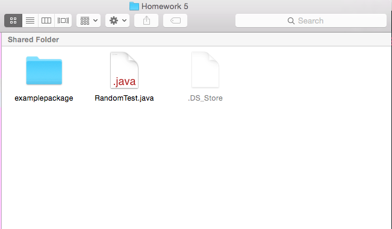

# Packages

## What is a package?
In java, a **package** is a group of classes/enums/things we haven't learned about yet that allows us to categorize the classes. It's really useful for organization, and it helps remove naming conflicts, and provide access protection - which basically just means we can limit which classes can use the Types in the package.

## What is the point of a package?
Lets imagine a world without packages:
* All of our code is in one folder
* We're only allowed to use a name once
* All of our classes have access to every other class in that directory

As you can probably imagine, this can get very out of hand very quickly.

## How do we create a package?
Creating a package is actually really easy! It involves a couple of steps:
1. Creating a folder that is the name of our package
2. Moving the java files that we want to be a part of the package into the folder
3. adding the line `package package_name` at the top of all the java files in the folder

For example if we had a file structure that looks like this, and we wanted our package name to be "examplepackage"


and a file named Test.java:
```java 
public class Test {
  public static void main(String[] args) {
    System.out.println("Hello!");
  }
}
```

We would then simply add our package name to the file so that it looks like:
```java
package examplepackage;
public class Test {
  public static void main(String[] args) {
    System.out.println("Hello!");
  }
}
```

And finally put our file into the directory of our package like so:

