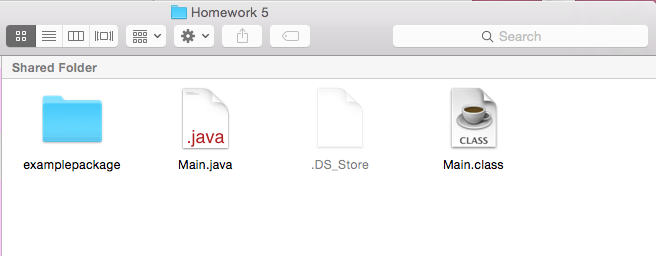
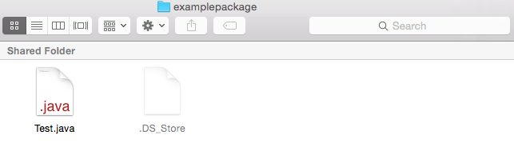

# Packages

## What is a package?
In java, a **package** is a group of classes/enums/things-we-haven't-learned-about that allows us to categorize the classes. It's really useful for organization, and it helps remove naming conflicts, and provide access protection.

## What is the point of a package?
Lets imagine a world without packages:
* All of our code is in one folder
* We're only allowed to use a name once
* All of our classes have access to every other class in that directory

As you can probably imagine, this can get very out of hand very quickly. With larger chunks of code, not making packages can make life difficult for us.

## How do we create a package?
Creating a package is actually really easy! It involves a couple of steps:
1. Creating a folder that is the name of our package
2. Moving the java files that we want to be a part of the package into the folder
3. adding the line `package package_name` at the top of all the java files in the folder

For example if we had a file structure that looks like this, and we wanted our package name to be "examplepackage"


and a file named Test.java:
```java 
public class Test {
  public static int sum(int a, int b) {
    return a + b;
  }
}
```

We would then simply add our package name to the file so that it looks like:
```java
package examplepackage;
public class Test {
  public static int sum(int a, int b) {
    return a + b;
  }
}
```

And finally put our file into the directory of our package like so:


## How do we use a package?
Now say we want to use the files in our "examplepackage" package. From a file named `Main` in the directory above it:

as we can see we have the package named "examplepackage" next to our file named `Main.java`. We now have to access the package in the `Main.java` file itself. Here is what Main.java looks like before we access the package.
```java
public class Main {
  public static void main(String[] args) {
    System.out.println(Test.sum(5, 4));
  }
}
```
In order for this to work we have to import the package, and the file. You have done this before for Scanner and Random! the line to do this happnes at the top of your program and follows the structure: `import package_name.ClassName;` For our example you can see it below:
```java
import examplepackage.Test;
public class Main {
  public static void main(String[] args) {
    System.out.println(Test.sum(5, 4));
  }
}
```

And thats it! Our package works and can be used by our class. 
